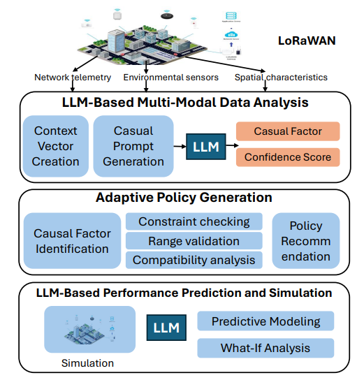
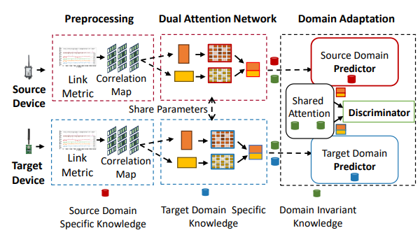
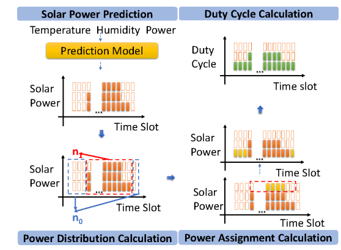
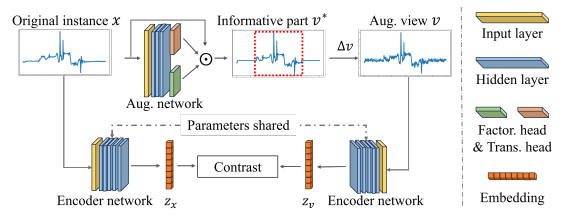

<div align="center">

# 👋 Aitian Ma (马艾田)

### Ph.D. Candidate in Computer Science
**Knight Foundation School of Computing and Information Sciences**  
**Florida International University**

📍 Miami, FL, USA | 🎯 **On the Job Market (2025-2026)**

---

<p align="center">
  <a href="#-about-me">About</a> •
  <a href="#-publications">Publications</a> •
  <a href="#-awards--honors">Awards</a> •
  <a href="#-experience">Experience</a> •
  <a href="#-teaching--mentoring">Teaching</a> •
  <a href="#-technical-skills">Skills</a> •
  <a href="#-lets-connect">Contact</a>
</p>

---

[](https://www.linkedin.com/in/aitian-ma-4267404a/)
[](https://scholar.google.com/citations?user=fsVMRlsAAAAJ&hl=en)
[](https://github.com/aitianma)
[](mailto:ama003@fiu.edu)


</div>

---

## 🎯 About Me

> **Seeking Faculty & Research Scientist Positions in AIoT, Wireless Sensing, and Edge Learning Systems**

I am a Ph.D. candidate at **Florida International University**, advised by **Dr. Mo Sha**. My research focuses on making wireless sensing and communication systems more **reliable**, **efficient**, and **intelligent** through AIoT and edge learning.

Before joining FIU, I earned my M.S. from Beijing University of Technology and worked as a **System Administrator & Instructor** at the Chinese Academy of Sciences (2013–2021).

### 🔬 Research Interests
```
🌐 Reliable and Adaptive Wireless Sensing
🤖 Resource-Efficient Edge Learning
📡 AI for Internet of Things (AIoT)
🔧 Intelligent Cyber-Physical Systems
```

---

## 📚 Publications

> 📊 **7 Conference Papers** | 📖 **1 Journal Paper** | 🏆 **2 Best Paper Awards**

### 🎓 Conference Papers

<details open>
<summary><b>Click to expand/collapse</b></summary>

<br>

<table>
<thead>
  <tr>
    <th width="35%">Visual</th>
    <th width="65%">Publication Details</th>
  </tr>
</thead>
<tbody>

<tr>
<td align="center">
  
</td>
<td>
  <h4>🔷 LLM-Driven Diagnosis and Adaptive Policy Optimization for Reducing Packet Error Rate in LoRaWAN Networks</h4>
  <p><i>Dongyi Ma, <b>Aitian Ma</b> (co-first author), Sirui Luo, Martin de Jode, Andrew Hudson-Smith, Mo Sha</i></p>
  <p>📅 <b>IEEE ICMLA</b>, December 2025</p>
  <p>📊 <code>Acceptance Rate: 16.6% (15/90)</code></p>
</td>
</tr>

<tr style="background-color: #f8f9fa;">
<td align="center">
  
</td>
<td>
  <h4>🔷 Sensorless Air Temperature Sensing Using LoRa Link Characteristics 🏆</h4>
  <p><i><b>Aitian Ma</b>, Jean Tonday Rodriguez, Mo Sha, Dongsheng Luo</i></p>
  <p>📅 <b>IEEE DCOSS-IoT</b>, June 2025</p>
  <p>📊 <code>Acceptance Rate: 23.6% (26/110)</code></p>
  <p>🏆 <b><span style="color: #d4af37;">Best Paper Award Nominee</span></b></p>
</td>
</tr>

<tr>
<td align="center">
  
</td>
<td>
  <h4>🔷 A LoRa-Based Energy-Harvesting Sensing System for Living Environment</h4>
  <p><i><b>Aitian Ma</b>, Jean Tonday Rodriguez, Mo Sha</i></p>
  <p>📅 <b>IEEE MetroLivEnv</b>, June 2025</p>
</td>
</tr>

<tr style="background-color: #f8f9fa;">
<td align="center">
  
</td>
<td>
  <h4>🔷 WMN-CDA: Contrastive Domain Adaptation for Wireless Mesh Network Configuration</h4>
  <p><i><b>Aitian Ma</b>, Mo Sha</i></p>
  <p>📅 <b>ACM SAC</b>, March 2025</p>
  <p>📊 <code>Acceptance Rate: 23.8% (5/21)</code></p>
</td>
</tr>

<tr>
<td align="center">
  
</td>
<td>
  <h4>🔷 Enabling Reliable Environmental Sensing with LoRa, Energy Harvesting, and Domain Adaptation</h4>
  <p><i><b>Aitian Ma</b>, Jean Tonday Rodriguez, Mo Sha</i></p>
  <p>📅 <b>IEEE ICCCN</b>, July 2024</p>
  <p>📊 <code>Acceptance Rate: 29.9% (47/157)</code></p>
</td>
</tr>

<tr style="background-color: #f8f9fa;">
<td align="center">
  
</td>
<td>
  <h4>🔷 Parametric Augmentation for Time Series Contrastive Learning</h4>
  <p><i>Xu Zheng, Tianchun Wang, Wei Cheng, <b>Aitian Ma</b>, Haifeng Chen, Mo Sha, Dongsheng Luo</i></p>
  <p>📅 <b>ICLR</b>, May 2024</p>
  <p>📊 <code>Acceptance Rate: 31.1% (2260/7262)</code></p>
</td>
</tr>

<tr>
<td align="center">
  
</td>
<td>
  <h4>🔷 AutoTCL: Automated Time Series Contrastive Learning with Adaptive Augmentations 🏆</h4>
  <p><i>Xu Zheng, Tianchun Wang, Wei Cheng, <b>Aitian Ma</b>, Haifeng Chen, Mo Sha, Dongsheng Luo</i></p>
  <p>📅 <b>AI4TS Workshop</b>, August 2023</p>
  <p>🏆 <b><span style="color: #d4af37;">Best Paper Award</span></b></p>
</td>
</tr>

</tbody>
</table>

</details>

### 📖 Journal Papers

<table>
<thead>
  <tr>
    <th width="35%">Visual</th>
    <th width="65%">Publication Details</th>
  </tr>
</thead>
<tbody>

<tr>
<td align="center">
  
</td>
<td>
  <h4>🔷 Adapting Wireless Network Configuration from Simulation to Reality via Deep Learning based Domain Adaptation</h4>
  <p><i>Junyang Shi, <b>Aitian Ma</b>, Xia Cheng, Mo Sha, Xi Peng</i></p>
  <p>📅 <b>IEEE/ACM Transactions on Networking</b></p>
  <p>📖 Vol. 32, Issue 3, pp. 1983–1998, June 2024</p>
</td>
</tr>

</tbody>
</table>

---

## 🏆 Awards & Honors

<table>
<thead>
  <tr>
    <th width="15%">Year</th>
    <th width="85%">Award</th>
  </tr>
</thead>
<tbody>
  <tr>
    <td align="center"><b>2025</b></td>
    <td>🌟 Young Gladiators Fellowship, <i>Northeastern University</i></td>
  </tr>
  <tr style="background-color: #f8f9fa;">
    <td align="center"><b>2025</b></td>
    <td>🏆 Best Paper Award Nominee, <i>IEEE DCOSS-IoT</i></td>
  </tr>
  <tr>
    <td align="center"><b>2023</b></td>
    <td>🏆 Best Paper Award, <i>AI4TS Workshop</i></td>
  </tr>
  <tr style="background-color: #f8f9fa;">
    <td align="center"><b>2011</b></td>
    <td>🥉 3rd Place, <i>Microsoft HPC Campus Programming Competition</i></td>
  </tr>
  <tr>
    <td align="center"><b>2007-2008</b></td>
    <td>🎓 National Encouragement Scholarship, <i>Henan Agricultural University</i></td>
  </tr>
</tbody>
</table>

---

## 💼 Experience

### 🎓 Academic & Research

<table>
<tbody>
  <tr>
    <td width="25%"><b>2022 – Present</b></td>
    <td width="75%">
      <b>Ph.D. Graduate Research Assistant</b><br>
      <i>Florida International University</i><br>
      Knight Foundation School of Computing and Information Sciences
    </td>
  </tr>
  <tr style="background-color: #f8f9fa;">
    <td><b>2013 – 2021</b></td>
    <td>
      <b>System Administrator & Instructor</b><br>
      <i>Chinese Academy of Sciences, Beijing</i><br>
      Mentors: Daniel Dajun Zeng, Yihua Du
    </td>
  </tr>
</tbody>
</table>

### 💻 Industry

<table>
<tbody>
  <tr>
    <td width="25%"><b>2012 (Summer)</b></td>
    <td width="75%">
      <b>Software Engineer Intern</b><br>
      <i>Ericsson China, Beijing R&D Center</i><br>
      Mentor: Ge Jiang
    </td>
  </tr>
</tbody>
</table>

---

## 👨‍🏫 Teaching & Mentoring

### 📚 Teaching Assistant — Florida International University

<table>
<thead>
  <tr>
    <th width="30%">Course</th>
    <th width="50%">Title</th>
    <th width="20%">Semester</th>
  </tr>
</thead>
<tbody>
  <tr>
    <td><b>COP 4338</b></td>
    <td>Programming III</td>
    <td>Fall 2024</td>
  </tr>
  <tr style="background-color: #f8f9fa;">
    <td><b>COP 5522</b></td>
    <td>Parallel and Distributed Computing</td>
    <td>Spring 2024</td>
  </tr>
  <tr>
    <td><b>COP 4710</b></td>
    <td>Database Management</td>
    <td>Fall 2023</td>
  </tr>
  <tr style="background-color: #f8f9fa;">
    <td><b>CEN 4010</b></td>
    <td>Software Engineering</td>
    <td>Spring 2023</td>
  </tr>
  <tr>
    <td><b>COP 4610</b></td>
    <td>Operating Systems</td>
    <td>Fall 2022</td>
  </tr>
</tbody>
</table>

### 🎯 Research Mentoring

- **REU Student Mentor** (2022–2025) — Mentored **10+ undergraduate students**
- **Instructor** — Chinese Academy of Sciences (2015–2019)  
  *Big Data Platform Workshop & Computer Networking Curriculum*

---

## 🔧 Technical Skills

<table>
<thead>
  <tr>
    <th width="25%">Category</th>
    <th width="75%">Technologies</th>
  </tr>
</thead>
<tbody>
  <tr>
    <td><b>💻 Programming</b></td>
    <td><code>Python</code> <code>C/C++</code> <code>Java</code> <code>SQL</code> <code>CUDA</code> <code>JavaScript</code></td>
  </tr>
  <tr style="background-color: #f8f9fa;">
    <td><b>🤖 ML Frameworks</b></td>
    <td><code>PyTorch</code> <code>TensorFlow</code> <code>Distributed Training</code> <code>Model Optimization</code></td>
  </tr>
  <tr>
    <td><b>🛠️ Systems</b></td>
    <td><code>Docker</code> <code>Kubernetes</code> <code>Spark</code> <code>Kafka</code> <code>Elasticsearch</code> <code>Neo4j</code> <code>PostgreSQL</code></td>
  </tr>
  <tr style="background-color: #f8f9fa;">
    <td><b>🎯 Focus Areas</b></td>
    <td><code>Wireless Sensing</code> <code>Edge AI</code> <code>Resource-Efficient Learning</code></td>
  </tr>
</tbody>
</table>

---

## 🤝 Professional Service

### 📝 Conference Reviewer
`DCOSS-IoT '25` • `MASS '25` • `LCN '25` • `CIT '25` • `ICMLA '25`

### 📰 Journal Reviewer
`IEEE TKDE` • `IEEE TC` • `IEEE TNNLS` • `Measurement Science and Technology` • `Computers in Biology and Medicine`

---

<div align="center">

## 📬 Let's Connect!

> **I'm actively seeking faculty positions and research scientist roles in AIoT, wireless sensing, and adaptive systems.**  
> Feel free to reach out for collaboration or discussion!

<br>

[](https://www.linkedin.com/in/aitian-ma-4267404a/)
[](mailto:ama003@fiu.edu)
[](https://scholar.google.com/citations?user=fsVMRlsAAAAJ&hl=en)

<br>

---

*Last Updated: October 2025*

</div>
